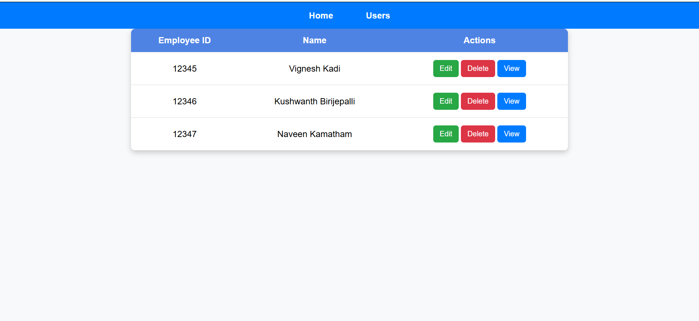

# UserHub
This application is used to collect employee data from the admin.

<details>
  <summary>Table of Contents</summary>
  <ol>
    <li>
      <a href="#description">Description</a>
      <ul>
        <li><a href="#features-of-the-application">Features of the Application</a></li>
        <li><a href="#application-demo">Application Demo</a></li>
      </ul>
    </li>
    <li>
      <a href="#getting-started">Getting Started</a>
      <ul>
        <li><a href="#prerequisites">Prerequisites</a></li>
        <li><a href="#development-server">Development Server</a></li>
        <li><a href="#installation">Installation</li>
      </ul>
    </li>
  </ol>
</details>

## Description
In this application, when admin opens the app, they are prompted to fill a form with employee details like first name, second name, email, employee id, role, and address and then the admin need to submit the form. <br/> When submitted, employees list is displayed and there the employees data can be edited,deleted and individual employees data also can be displayed.<br/><br/> 
### Features of the application
- Details of the new employee are taken from a form.
- All the employees in the organization can be seen using users navigation.
- Individual employee details can be displayed.
- Details of the employee can be updated.
- Employee can be deleted

### Application Demo

#### Home Page


#### Employees Page


#### Individual Employee page


## Getting Started<br/>
This project was generated with [Angular CLI](https://github.com/angular/angular-cli) version 14.2.13. <br/>
### Prerequisites
The application can be forked or cloned into the local machine. Once forked or cloned, install the following dependencies by running:<br/>

* node 16
    ```sh
    npm install -g npm@16
    ```
* angular cli 14
    ```sh 
    npm install -g @angular/cli@14
    ```
* typescript 4.8.4
    ```sh
    npm install -g typescript@4.8.4
    ```
* rxjs 6.5.4
    ```sh
    npm install -g rxjs@6.5.4
    ```
### Installation

_Below is an example of how you can instruct your audience on installing and setting up your app. This template doesn't rely on any external dependencies or services._

1. Clone the repository:
   ```sh
   git clone https://github.com/Vignesh-0521/Task-01-User-Hub
   ```
2. Install dependencies:
   ```sh
   npm install
   ```
3. Run the application
   ```sh
   ng serve
   ```
4. Open the browser and navigate to:
   ```sh
   http://localhost:4200
   ```

### Development Server

Run `ng serve` for a dev server. Navigate to `http://localhost:4200/`. The application will automatically reload if you change any of the source files.


